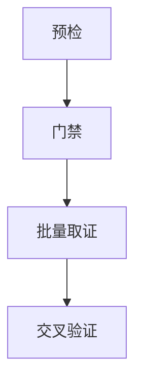

# dsh-opensecurity

给 [DeepSeek Harness](https://github.com/deepseek-ai/deepseek-harness)（dsh）装一套**本地、闭卷、可复现**的二进制逆向工作台：IDA 驱动的 `os_*` 工具面 + 随包知识库 skill + 首步门禁，另附 Web 界面里 **mermaid 示意图原位渲染**。

一个包，双面（dual-face）：

| 半边 | 内容 | 实现 |
|---|---|---|
| **Host** | 7 个 `os_*` 工具（IDA 静态/动态分析、环境探测、目标预检）、首步门禁、随包方法论知识库、agent preset | `lib/index.js`、`lib/preflight.js`、`lib/runner.js`、`lib/closed-book.js` |
| **Client** | 回复里的 ` ```mermaid ` 代码块在 Web 界面原位渲染成示意图（7 种图型），设置页「图表」分区 | `lib/client.js`（预构建）、`lib/diagram.js`（宿主配对路由） |

安装完就两件事都齐：**工具面**由宿主 loader 按行挂载，**渲染器**由 `dsh-client-modules` 扫描 `package.json` 的 `dsh.client` 声明后自动注入浏览器 —— 不需要你手改前端。

---

## 前置要求

- 一个可用的 dsh（本插件按 bundle patch 层组合，需要 `dsh --profile <name>` 能启动）
- **Web profile**（`dsh web` / `dsh --profile web`）——只有它带 `webServer`，图渲染才激活；纯终端 profile 下渲染行自动不激活，二进制工具照常
- **IDA Pro**（`os_ida_*` 工具需要 `idat.exe` / `idat64.exe`）。`idatPath` 留空时插件会探测常见安装位置（安装版与便携版），找不到会**显式报告**而不是静默失败
- **Python 3**（知识库里的脚本由它执行）
- 可选：Frida / unicorn 等（部分方法论 skill 会用到；缺什么由 `os_preflight` 提前告诉你）

---

## 安装

```sh
# 推荐：直接从 GitHub 装
dsh plugin --profile web add github:GQS220509/dsh-opensecurity

# 本地开发：指向你的工作副本
dsh plugin --profile web add file:D:\path\to\dsh-opensecurity
```

装完**重启 dsh**。原因不是"要重新编译"，而是两处按启动装配：组合树在 boot 时 patch，`dsh-client-modules` 对每个包名的客户端判定是**按名缓存、永不过期**的（插件集合变化在重启后生效）。

> ⚠️ **如果你之前装过 `dsh-opensecurity-binary`，先移除它**：
> ```sh
> dsh plugin --profile web remove dsh-opensecurity-binary
> ```
> 两者会注册同名工具，重复名会让层加载抛错。

---

## 默认是「闭卷」，怎么开网

本插件的设计前提是**不许上网搜答案**：随包 patch 会关掉联网工具与联网能力（`tool-web` / `web` / `web-search-deepseek`）。想保留联网，三种做法任选：

| 做法 | 操作 |
|---|---|
| A. 改随包 patch | 删掉 `cordis.patch.yml` 里 `BEGIN-OFFLINE` 到 `END-OFFLINE` 之间的整段 |
| B. 叠加反向覆盖层 | `dsh --profile web --patch <插件目录>/overlays/enable-network.yml` |
| C. 改你自己的 profile 层 | 在 `~/.ohdsh/profiles/web/cordis.patch.yml` 里重述这三行并写 `disabled: false` |

闭卷**只关联网**，不影响本地 HTTP 服务，所以图渲染照常工作（两者是不同的行）。

---

## 可选：把能力收窄成一个 agent preset

`overlays/with-agent-preset.yml` 里给出了一行配置，把 capability 收进一个名为「二进制分析」的 preset：该 preset 下**只挂 `os_*` 工具**——没有 shell、没有文件系统工具、没有子代理、不联网。

```sh
# 把 overlays/with-agent-preset.yml 里的 <你的 profile> 换成实际 profile 名，然后：
dsh --profile <你的 profile> --patch <插件目录>/overlays/with-agent-preset.yml
```

为什么不能随包自动生效：agent preset 的 roster **只按目录发现**，而随包目录的真实路径里含 profile 名，插件在组合期不知道自己被装到哪个 profile 下（`dsh-agent-presets` 的 roots 只接受文件系统路径）。所以这一步留给你一行配置。

---

## 用法

### 二进制分析（`os_*` 工具）

| 工具 | 作用 |
|---|---|
| `os_binary_boot` | 入口门禁：报告 idat 路径、Python、知识库索引、本次产物目录（每个会话第一步注入提醒要求先调它） |
| `os_ida_initial` | 对目标做首次装载分析（架构/位数/段/入口/导入） |
| `os_ida_query` | 单次 IDA 查询（反编译、反汇编、交叉引用、字符串、函数信息…） |
| `os_ida_batch` | **一次 IDA 会话内**跑多个查询，省掉 N−1 次冷启动（推荐优先用它） |
| `os_ida_update` | 回写数据库：改符号名、加函数注释、加行注释 |
| `os_env_detect` | 探测本机逆向工具链（IDA/Frida/调试器/python 包） |
| `os_preflight` | 按目标文件判断需要什么、本机有没有，缺软件**提前**停下反馈（省 token） |

典型流程：`os_preflight` → `os_binary_boot` → 按需 `skill` 加载方法论 → `os_ida_batch` 批量取证 → 验证（不许把猜测说成结论）。

### 图渲染（mermaid）

直接在回复里写代码块即可：

````

````

- 支持 `flowchart/graph`、`sequenceDiagram`、`classDiagram`、`stateDiagram`、`erDiagram`、`gantt`、`pie`；其它图型只显示源码，别用
- 可读性硬要求：默认 TB 单列、节点文字短、总数 ≤15；图会被缩放到消息宽度
- 渲染脚本由宿主从**本插件依赖树里的 mermaid 包**分发（路由 `/dsh-opensecurity/mermaid.min.js`，仅接受回环同源请求），**不走 CDN**
- 设置页 →「图表」可关掉自动渲染（偏好存在浏览器 `localStorage`）

---

## 包里有什么

```
lib/index.js             host 半边：7 个工具 + 首步门禁 + 配置 schema
lib/preflight.js         目标预检（os_preflight 的判定逻辑）
lib/runner.js            idat 调用与结果读取
lib/closed-book.js       闭卷模式下的工具面收敛
lib/diagram.js           diagram host 半边：mermaid 路由 + 画图规范段
lib/client.js            diagram client 半边（预构建，见下）
assets/binary-analysis/  方法论知识库 + 18 个分析脚本 + registry.json
assets/skills/           由知识库生成的 skill（SKILL.md）
agent-presets/           「二进制分析」preset 组装文件
overlays/                可选覆盖层：开网 / 启用 preset
src/diagram/             diagram 半边的 TypeScript 源码（供继续维护）
docs/                    设计笔记
```

### 关于 `lib/client.js`

它是浏览器端的**预构建产物**，格式是 dsh 客户端模块系统的约定（`window.__ModuleLoader__.load({ id, factory })`），其中 **`id` 必须等于包名**（这里是 `dsh-opensecurity`）。已按包名重写过 id 与 mermaid 路由。

- 只读，不要手改（除 id 与路由这类标识）。
- 要改渲染器逻辑：改 `src/diagram/client/*`，用 DSH 仓库的客户端打包工具链重新构建，回填 `lib/client.js` **并保持 id 等于包名**。本仓库不重复实现那套工具链。
- `src/diagram/index.ts` 是 diagram host 半边的源码，对应 `lib/diagram.js`。

---

## 已知限制

- **客户端半边是预构建产物**：仓库带源码但不在本仓库里重建（需要 dsh 的客户端打包链）。
- **非 Web profile 下渲染不激活**：没有 `webServer` 服务时该行按"服务可用性驱动"自动不激活，这是设计而非缺陷。
- **IDA 路径靠探测**：探测清单覆盖常见安装/便携位置；装在别处请在 config 里显式给 `idatPath`。
- **Windows 优先**：随包脚本与工具面在 Windows 上验证最充分；Linux 上工具面可用，但部分脚本里的路径假设需要自行调整。
- **资产来源**：`assets/` 来自 OpenSecurity 项目，`src/diagram/` 与 `lib/client.js` 来自 dsh-diagram 插件，均由本项目作者发布，随包沿用 MIT。你再分发前请确认你持有相应权利。
- **Windows Defender 误报（可能少一个 skill）**：`assets/binary-analysis/knowledge-base/crypto-validation-patterns.md`（密码学验证方法论）与由它生成的 `assets/skills/crypto-validation-patterns/SKILL.md` 常被 Windows Defender 判定为"潜在不需要的软件"，并在写入后数秒内隔离删除 —— 表现为 clone/安装后知识库少一篇、skill 少一个。**不影响插件启动与其余能力**。处理办法：给仓库目录加 Defender 排除项（设置 → 病毒和威胁防护 → 排除项），再从 OpenSecurity 源仓库取回这两个文件；若本机装过旧版 `dsh-opensecurity-binary`，其目录下的同名文件就是同内容副本。

---

## 开发

```sh
npm run check        # node --check 两个入口 + 校验 package.json
```

- 改 host 半边：`lib/*.js` 是纯 ESM，**无需构建**，改完重启 dsh 即可。
- 改 patch：profile 层与 home 层的 `cordis.patch.yml` 有 watcher，改完不用重启（插件集合变化仍需重启）。
- 自检路径：`dsh --profile <name> --dump-config` 看合成后的整棵树。

## License

MIT，见 [LICENSE](LICENSE)。

---

## English quickstart

`dsh-opensecurity` is a dual-face dsh plugin: an IDA-driven binary reverse-engineering tool surface (`os_*` tools, bundled knowledge-base skills, a closed-book gate) plus in-place mermaid rendering in the Web UI.

```sh
dsh plugin --profile web add github:GQS220509/dsh-opensecurity
# restart dsh, then click "重新加载" in the browser
```

Requirements: a running dsh (Web profile for diagram rendering), IDA Pro (`idat.exe`/`idat64.exe`) for the IDA tools, Python 3 for the bundled scripts. The bundled patch disables network tools by default (closed-book); delete the `BEGIN-OFFLINE`…`END-OFFLINE` block in `cordis.patch.yml`, or apply `overlays/enable-network.yml`, to keep `web_search`.
